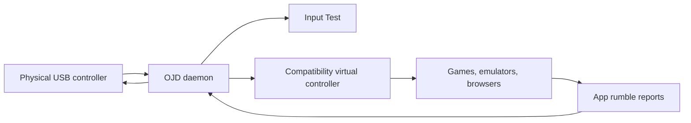

# OpenJoystickDriver

OpenJoystickDriver is a macOS menu-bar app and daemon that turns supported
physical controllers into app-friendly virtual controllers.

Use it when a controller works in OJD but not in a game, emulator, browser, SDL
app, or native macOS app.


## What Works Today

- ✅ GameSir G7 SE: hardware verified through GIP and Xbox One HID compatibility.
- ✅ Flydigi Vader 5S: supported through GIP with its required USB setup quirk.
- ✅ Sony DualShock 4 USB/Bluetooth: input and physical rumble are implemented.
- ✅ Xbox 360 USB profiles: supported through Xbox 360 HID-style parsing.
- ✅ App-facing compatibility modes: SDL 2/3, Apple GameController, Generic HID,
  Xbox 360 HID, and Xbox One HID.
- 🚧 More xpad-derived Xbox profiles exist but still need local hardware checks.
- ❌ Sony DualShock 3, Sony DualSense, non-DS4 Bluetooth, and Switch Pro are not
  implemented.

For the full feature matrix, mapping notes, and per-mode caveats, see
[docs/COMPATIBILITY_LAYERS.md](docs/COMPATIBILITY_LAYERS.md).

## Install For Local Development

Requirements:

- macOS 10.15 or later
- Xcode Command Line Tools or Xcode
- `libusb`

```bash
brew install libusb
xcode-select --install
git clone https://github.com/xsyetopz/OpenJoystickDriver.git
cd OpenJoystickDriver
./scripts/ojd signing install-profiles
./scripts/ojd signing configure
./scripts/ojd rebuild dev
```

The build installs:

```text
/Applications/OpenJoystickDriver.app
```

Open that app from `/Applications`. OJD is menu-bar-only; it does not use a
normal main window.

## First Run

1. Open `OpenJoystickDriver.app`.
2. Grant **Input Monitoring** to the daemon if macOS asks.
3. Connect a supported USB controller.
4. Open the menu-bar item and choose **Input test**.
5. Move sticks, press buttons, and use **Physical output** to test rumble.

Grant Input Monitoring to this binary:

```text
/Applications/OpenJoystickDriver.app/Contents/Library/LoginItems/OpenJoystickDriverDaemon.app/Contents/MacOS/OpenJoystickDriverDaemon
```

Accessibility permission is not required for normal controller output.

Development builds signed ad hoc can lose macOS permission grants after rebuilds
because TCC tracks the binary code identity. Use an Apple Development identity
for stable local testing.

## Pick A Compatibility Mode

Start with **Compatibility** mode and the **SDL 2/3** identity.

- Use `SDL 2/3` for Steam, PCSX2, DuckStation, Moonlight/SDL, and most emulator
  or game-launcher paths.
- Use `Apple GameController` for native macOS apps that read `GCController`.
- Use `Generic HID` for apps that inspect HID descriptors directly.
- Use `Xbox 360 HID` or `Xbox One HID` only when testing a picky app that expects
  a Microsoft-style HID device.

CLI equivalents:

```bash
/Applications/OpenJoystickDriver.app/Contents/MacOS/OpenJoystickDriver --headless compat sdl2-3
/Applications/OpenJoystickDriver.app/Contents/MacOS/OpenJoystickDriver --headless output secondary
```



## PCSX2

For PCSX2, use SDL 2/3 Compatibility with user-space-only output:

```bash
./scripts/ojd install pcsx2-sdl-db
./scripts/ojd install pcsx2-profile
./scripts/ojd launch pcsx2
```

The launcher sets the known-good routing before starting PCSX2. The input
profile is a starting template for Pad 1. Focus-routed builds can expose
multiple OJD SDL instances, so in PCSX2 bind the OJD controller that only
responds while the PCSX2 window is focused instead of assuming it will always
be `SDL-0`.

## Useful Commands

```bash
./scripts/ojd rebuild dev
./scripts/ojd rebuild-fast dev
./scripts/ojd validate profiles
./scripts/ojd diagnose backends --seconds 5
./scripts/ojd diagnose gamecontroller --seconds 5 --rumble
./scripts/ojd diagnose sdl3-gamecontroller --seconds 5
./scripts/ojd diagnose sdl3-hidapi-x360 --seconds 5
swift test
```

From the installed app bundle:

```bash
/Applications/OpenJoystickDriver.app/Contents/MacOS/OpenJoystickDriver --headless status
/Applications/OpenJoystickDriver.app/Contents/MacOS/OpenJoystickDriver --headless list
/Applications/OpenJoystickDriver.app/Contents/MacOS/OpenJoystickDriver --headless restart
```

## Controller Profiles

Runtime profiles live in:

```text
Sources/OpenJoystickDriverKit/Resources/Controllers/
```

Device schemas live in:

```text
Resources/Schemas/Devices/
```

Profile rules:

- Use decimal VID, PID, endpoint, and packet values.
- Use repo URL `$schema` references, not local file URLs.
- Add a matching device schema for GIP controllers.
- Keep protocol variants and mapping flags in data where possible.

Validate profile changes with:

```bash
./scripts/ojd validate profiles
```

## Architecture In One Minute

Input:

```text
USB vendor-specific devices -> LibUSB / SwiftUSB -> GIPParser
USB/Bluetooth HID devices   -> IOHIDManager      -> DualShock 4 parser or GenericHIDParser
```

Output:

```text
DriverKit HID backend       -> private OJD relay / diagnostics
IOHIDUserDevice backend     -> app-facing compatibility controllers
```

Each physical controller gets its own `DevicePipeline` actor. The daemon owns
controller I/O and XPC APIs; the menu-bar app is only the user interface.

If macOS keeps an old DriverKit process alive after an extension update, repair
it with:

```bash
./scripts/ojd repair stale-dext
```

More architecture and contributor detail lives in [docs/ARCHITECTURE.md](docs/ARCHITECTURE.md).

## Agent Context

- [AGENTS.md](AGENTS.md) - repo working rules
- [docs/ARCHITECTURE.md](docs/ARCHITECTURE.md) - runtime boundaries
- [docs/COMPATIBILITY_LAYERS.md](docs/COMPATIBILITY_LAYERS.md) - feature matrix and mappings
- [llms.txt](llms.txt) - concise project map
- [llms-full.txt](llms-full.txt) - expanded implementation context
